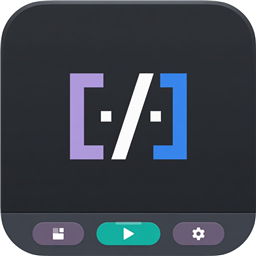

  

# Status Bar Tasks

**Show workspace tasks as buttons on the VS Code status bar**

  
  
  

---

### Getting started

1) Install **Status Bar Tasks** from the [VS Code Marketplace](https://marketplace.visualstudio.com/items?itemName=gvastethecreator.status-bar-tasks).
2) Open a folder that has workspace tasks.
3) Click a task on the status bar, or open **Status Bar Tasks: Open Status Bar Tasks Settings**.

---

  
  <a href="https://github.com/gvastethecreator"><picture><source media="(prefers-color-scheme: dark)" srcset="https://shieldcn.dev/badge/follow%20me-/gvastethecreator.png?size=xs&amp;logo=github&amp;brand=github&amp;mode=dark"></picture></a>
  <a href="https://github.com/sponsors/gvastethecreator"><picture><source media="(prefers-color-scheme: dark)" srcset="https://shieldcn.dev/badge/support%20this-project.png?size=xs&amp;logo=ri%3APiHeartFill&amp;logoColor=b85a90&amp;brand=github&amp;mode=dark"></picture></a>

