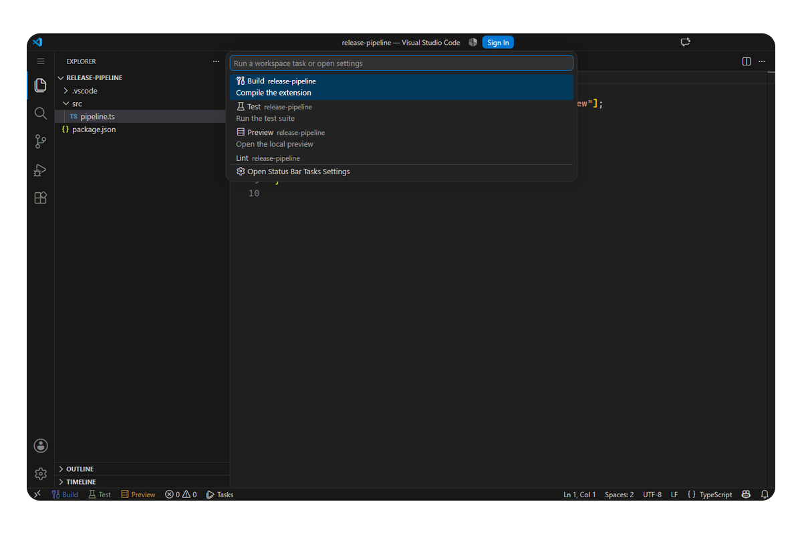
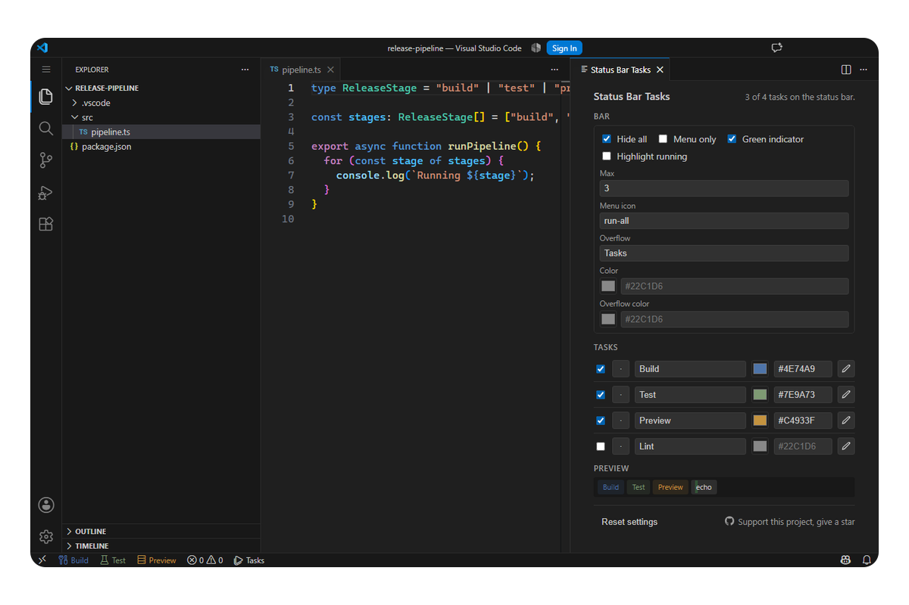

  

# Status Bar Tasks

**Run workspace tasks from one small Status Bar menu.**

  
  
  
  
  

Keep every matched task in one menu and pin up to ten frequent tasks beside it.

<table>
  <tr>
    <td width="50%"></td>
    <td width="50%"></td>
  </tr>
  <tr>
    <td align="center">Task menu and pinned tasks</td>
    <td align="center">Compact settings</td>
  </tr>
</table>

## Highlights

- Pin, label, color, and reorder workspace tasks from a compact settings panel.
- Start idle tasks and focus the terminal of running tasks.
- Optional task icons, file filters, and running states.
- Shell, process, compound, background, and provider tasks.

## Use

Open a folder with VS Code tasks, then run **Status Bar Tasks: Open Status Bar Tasks Settings** and pin the tasks you want. All matched tasks remain available from the main task menu.

Remote Development is supported. Virtual Workspaces, browser hosts, and Restricted Mode are not. No telemetry or product network requests.

More details: [product contract](docs/PDR.md) · [compatibility](docs/COMPATIBILITY.md) · [publishing](docs/PUBLISHING.md)

---

  
  
  
  

